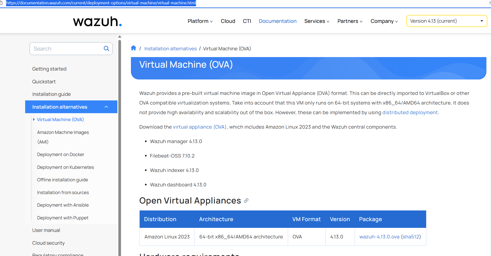

# Infrastructure Overview

Lab Infrastructure and Wazuh VM Setup

## 1️⃣ Hardware Available for Testing

- Personal host PC with VirtualBox installed (AMD 7900, 12 cores, 32 GB DDR5 RAM)  
- Wazuh OVA (Open Virtualization Appliance) downloaded  
- Ubuntu and Kali Linux ISO images  
- MikroTik HAP AC Lite router  
- Virtual machines configured in bridge mode within the lab

---

## 2️⃣ Wazuh VM Setup

The first step was creating the **Wazuh virtual machine** with the following resources:

| Component | Specification |
|-----------|---------------|
| CPU       | 4 cores       |
| RAM       | 8 GB          |
| Storage   | 50 GB SSD     |

The official **Wazuh OVA** includes a full stack:

<br><br>

| Component | Description |
|-----------|-------------|
| **Wazuh Manager** | Receives logs from agents and applies detection rules |
| **Filebeat** | Collects logs and forwards them to Elasticsearch |
| **Kibana / OpenSearch Dashboards** | Web interface to view alerts, manage agents, and configure rules |
| **Wazuh API** | REST service to manage agents, rules, and queries from scripts or integrations |
| **Wazuh Indexer** | Replaces Elasticsearch for integrated index management (latest versions) |

**Updating commands:**

```bash
# Update Wazuh VM
sudo yum update

# Update Ubuntu/Suricata VMs
sudo apt update && sudo apt upgrade

# Check service status
systemctl status suricata
systemctl status wazuh-agent
