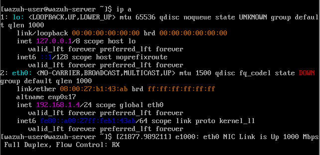
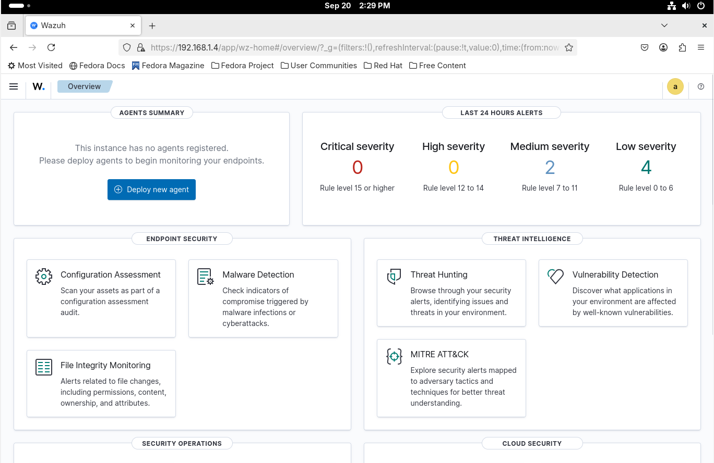

# Wazuh Server Installation

## Initial configuration
I started the Wazuh VM and logged in using the default credentials for this test.<br>
**login: wazuh-user**<br> **Password:wazuh . <br>**



In the Wazuh server console, I ran the `**ip a**` command to check which IP address was assigned via DHCP.

<br>
After completing the installation of Fedora, Ubuntu, and Kali Linux, and ensuring that the VMs were in bridge mode on the same network as the Wazuh server, I verified the IP addresses they obtained and confirmed that they could ping each other without issues.

<br>
> Note: The VMs are using DHCP, so their IP addresses can change after each reboot. I reserved the lease on the DHCP server/router for each VM's MAC address.  
> (I used `ip link show` to see the MAC address of the virtual interface.)

### Temporary solution to assign a static IP:


**sudo ip addr add 192.168.1.4/24 dev eth0**
**sudo ip addr del 192.168.1.*/24 dev eth0  # removes the previous DHCP IP**<br>
Alternatively, if the Wazuh server is always assigned the same IP (e.g., 192.168.1.6), I can change the Wazuh server IP in the ossec.conf file on the target VM. For example, on the Ubuntu VM:

**sudo nano /var/ossec/etc/ossec.conf**
<br>
Next, I connected to the Wazuh server IP from a browser using all the VMs (here 192.168.1.4).

<br>
As shown in the image, the Wazuh Dashboard opened. By logging in with the default credentials (admin-admin), I accessed the dashboard with all the data and configuration options that Wazuh provides.

<br> ```

