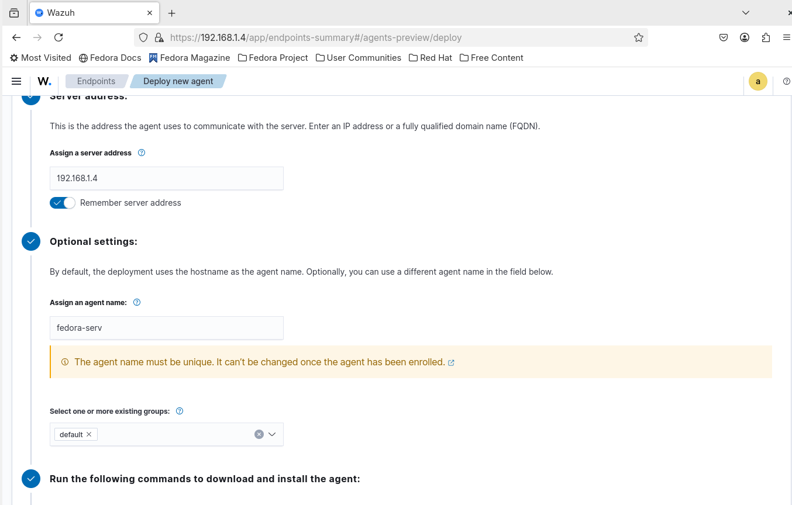
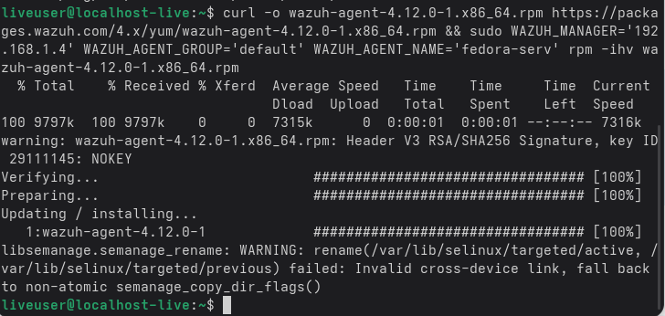
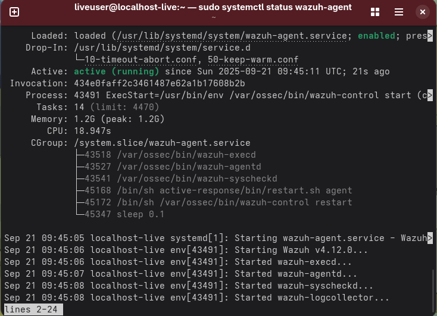
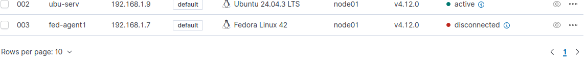
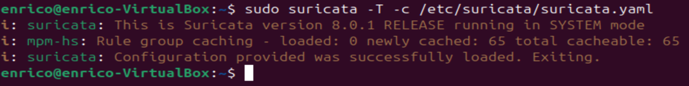

# STEP 1 : Wazuh: Install & enroll the agent
To get started, I installed the Wazuh agent on each VM, except for the Kali Linux VM (which will act as the attacker), by clicking the blue "Deploy New Agent" button.  

  

I entered the Wazuh server IP, selected the operating system where I would install the agent, gave it a name, and chose a group to assign it to. Finally, I simply copied the commands generated by the interface—a straightforward process that reminded me of how I used to install the **Acronis Cyber Backup agent** on new machines belonging to client company tenants during my recent internship at Cloudfire as a **Cloud Engineer**. 

  
The installation process for the Debian and Ubuntu agents is basically just slightly different. 

I repeated the same process for the Ubuntu VM and verified the status of the Wazuh agent on both machines using the command `**sudo systemctl status wazuh-agent**  

  

If the agents were installed correctly and connected to the Wazuh server, they should appear as **active** in the dashboard. In this lab, the VM where I will install Suricata will be only the Ubuntu VM, so the Fedora VM will remain powered off and its agent will show as **disconnected**. 

  

## STEP 2: Suricata integration
I then installed Suricata in NIDS (Network Intrusion Detection System) mode on the Ubuntu VM.  

**sudo apt update 
sudo apt install suricata -y 
sudo suricata-update**   
It may report issues with the process because the .yaml configuration file needs to be corrected with the proper values. 
  

I opened the main configuration file:

**sudo nano /etc/suricata/suricata.yaml** 
(I use CTRL+W to search inside the file.)

Main parameters to configure: 
   
**HOME_NET: "IP of your Network"**                #The more specific the network definition, the better the detection accuracy and performance.
**EXTERNAL_NET: "any"**  
**default-rule-path: /etc/suricata/rules**  
af-packet:
  interface: **enp0s3**   # I check the correct interface using: **ifconfig -a**   
Note:
Ubuntu typically assigns names such as enp0s3 to network interfaces on VirtualBox. 

Older systems used names like eth0, but with the Predictable Network Interface Names system, the format is now enpXsY.
Understanding Why Suricata Is Not Installed on Every Machine

Suricata is not an antivirus and it is not an EDR.It is a Network Intrusion Detection/Prevention System (NIDS/NIPS), and its purpose is to monitor network traffic, not the internal activity of each endpoint.
Because of this, Suricata should not be installed on every machine.

**Why Suricata Is Not Installed on Every Endpoint?**

Suricata analyzes network traffic, so installing it on all endpoints would be inefficient and ineffective:
*It would waste CPU and RAM on every host
*It would not provide a centralized view of the network
*Each installation would only see the local traffic of that single machine

**A NIDS is most effective when placed in a location where all network traffic passes through,like on the Firewall, because all LAN ↔ WAN traffic goes through the firewall, so Suricata can inspect everything.
Another enterprise option is a Server Using Port Mirroring (SPAN) but this is out of scope of my home-lab security project.**  

**Configuration details**  
**HOME_NET**:
This variable must be set to the IP address (or network range) of the agent.       #The more specific the network definition, the better the detection accuracy and performance. 
It defines the internal or protected network that Suricata must monitor. 

**EXTERNAL_NET**:
This is usually set to "any" so Suricata monitors traffic from any external IP address.
It represents everything outside the protected network.

**default-rule-path**:
This is the path where Suricata stores its rule files.
Suricata uses these rules to detect threats and suspicious traffic.

**af-packet**:
This capture method allows Suricata to read network packets directly from a NIC.
**It must be configured with the correct interface** (e.g., eth0, enp0s3, etc.) so that Suricata can actually see the traffic.

