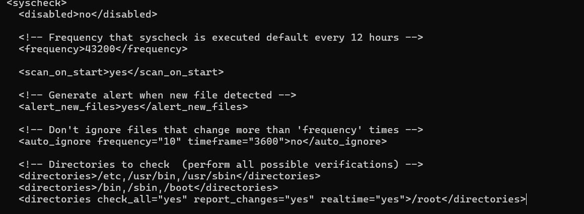

# STEP 1:  Integrate VirusTotal with the Wazuh manager

On the WAZUH-SERVER terminal
```bash
sudo nano /var/ossec/etc/ossec.conf
```

 **I inserted this block**
 ```bash
 <integration>
   <name>virustotal</name>
   <api_key>PERSONAL_API_KEYS _VIRUSTOTAL</api_key>
   <rules_id>100200,100201</rules_id>
   <alert_format>json</alert_format>
  </integration>
```

 **<rule_id>100200,100201</rule_id>**: represents the rule that triggers the VirusTotal inspection. In this case, we have rule ID 100200 and 100201. I haven't created these rules yet so I wrote these rules to detect file changes in a specific folder of the endpoint. 


## LET'S CREATE THE WAZUH RULE ON WAZUH MANAGER

I wanted to trigger VT scanning only when any file was changed, deleted or added to avoid "bilions" of false positive alerts.

**A File Integrity Monitoring (FIM) it's a security technology that monitors files on a system to detect unauthorized changes.
Typically used in Intrusion Detection and Prevention Systems (IDS/IPS) and platforms like Wazuh or OSSEC.
It monitors attributes such as:

* File creation / deletion
* Content modification
* Permission or ownership changes
* File hashes or checksums
 ```bash
sudo nano /var/ossec/etc/ossec.conf
 ```

<br>

**Search for the syscheck block.**
I then added this line for /root immediately after the other <directories> entries:
 ```bash
<directories check_all="yes" report_changes="yes" realtime="yes">/root</directories>
 ```
Ctrl+X

**Restart the Wazuh agent:**

 ```bash
sudo systemctl restart wazuh-agent
 ```

**Expected result<br>
Any changes in /root (file creation, modification, deletion) will trigger a Wazuh alert. <br>**

The corresponding alerts will have rule IDs 100200 and 100201 as indicated.


 
