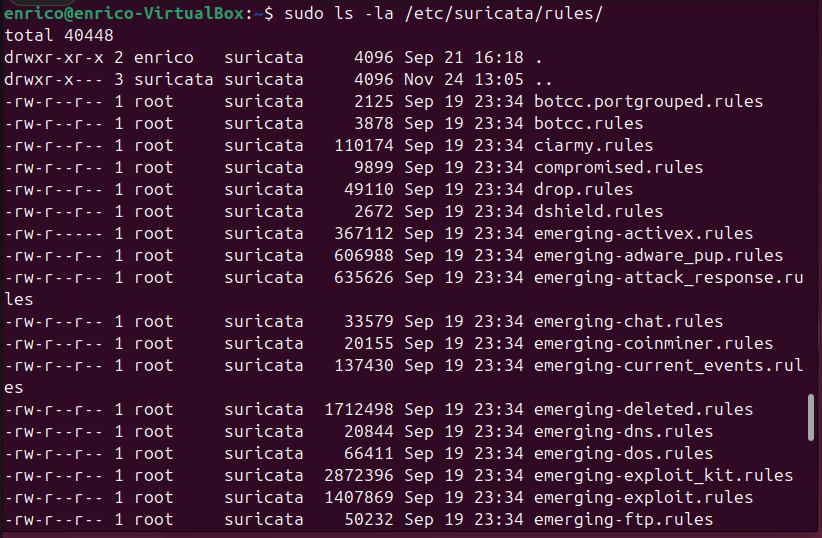

# STEP 1: 

Using pentesting tools on the Kali Linux machine, I performed several scans to gather information about the target Ubuntu machine and attack it, in order to verify whether the Wazuh agent together with Suricata detected the malicious activity.


Let's remember that Suricata is not a behavioral IDS; it is a rule-based IDS.

Therefore:

* if a rule exists → Suricata generates an alert
* if a rule does not exist → Suricata does not report anything

<br>
I created a custom Suricata rule on port 22 just to learn how to create one in the future.

**a) Open the local.rules file:**
```bash
sudo nano /etc/suricata/rules/local.rules
```

**b)Insert the Suricata rule for port 22 using the correct syntax**

**alert tcp $EXTERNAL_NET any -> $HOME_NET 22 (msg:"SSH connection detected"; flow:to_server,established; content:"SSH-2.0-OpenSSH"; sid:100001;)**
Press Ctrl+X to exit and save.

**Explanation of the rule:**
```bash
alert → generates an alert if the conditions of the rule are met.
tcp → the monitored protocol is TCP.
$EXTERNAL_NET any -> $HOME_NET 22 → traffic from any external IP to the internal network on port 22 (SSH).
msg:"SSH connection detected"; → the message that appears in the alert, indicating an SSH connection was detected.
flow:to_server,established → checks only established connections directed to the server, avoiding alerts for failed initial attempts.
content:"SSH-2.0-OpenSSH" → searches for this string in the packet content; it is the typical identifier of SSH/OpenSSH connections.
sid:100001 → unique identifier of the rule.
```
## STEP 2: Kali Linux VM used to test alert responses on the Wazuh dashboard

I fed Hydra a text file, created in 10 seconds with AI, containing a set of 4‑digit codes often used as passwords, such as 1234, 1111, 0000, 1212, etc.
If I had wanted to spend more time, I could have added longer combinations or names, but this is not a PenTesting lab, and my goal was simply to see the alerts appear on my Wazuh dashboard.
With social engineering tactics, it wouldn't be very difficult for a malicious actor to achieve the same outcome.<br>

On the dashboard, in the Discover section, dozens of alerts appeared, generated by Suricata, which detected a large number of SSH access attempts.
The Suricata signature involved is associated with reconnaissance, malware, and scanning tools such as Nmap.
Through email notifications, it is possible to configure parameters and rules so that attempts like this trigger a timely alert for the SOC analyst.
Reconnaissance is the first phase of the hacking methodology and penetration testing. It involves gathering information about the target before launching an attack.<br>



**ICMP FLOOD ATTACK**

| Field | Value |
|-------|-------|
| Source IP | 192.168.1.6 |
| Destination IP | 192.168.1.9 |
| Protocol | ICMP |
| Event Type | alert |
| Direction | to_server |
| Interface | enp0s3 |
| Bytes to Client | 9,280,894 |
| Bytes to Server | 9,280,992 |
| Packets to Client | 94,703 |
| Packets to Server | 94,704 |
| Flow Start | 2025-09-21T17:12:17.726354+0200 |
| Rule Description | Suricata: Alert - GPL ICMP_INFO PING *NIX |
| Rule ID | 86601 |
| Rule Fired Times | 31,575 |
| Rule Level | 3 |
| Location | /var/log/suricata/eve.json |
| Manager | wazuh-server |
| Timestamp | Sep 21, 2025 @ 17:13:32.714 |
**alert generato


