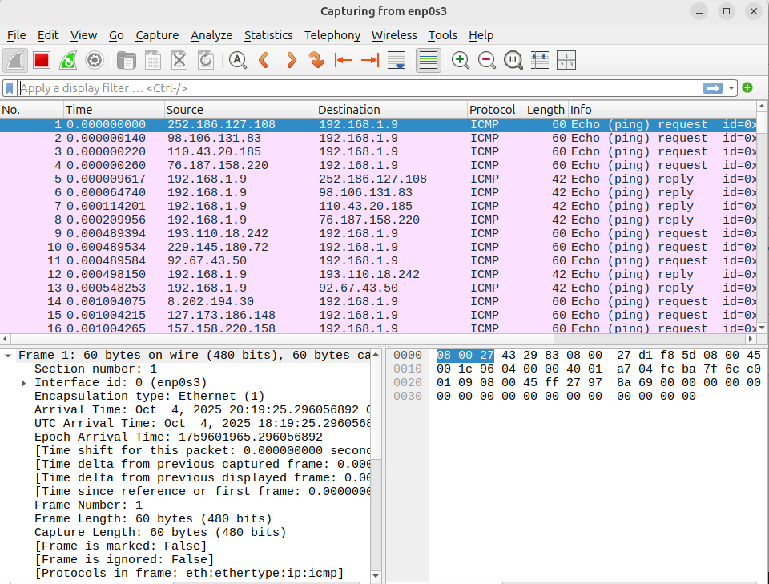
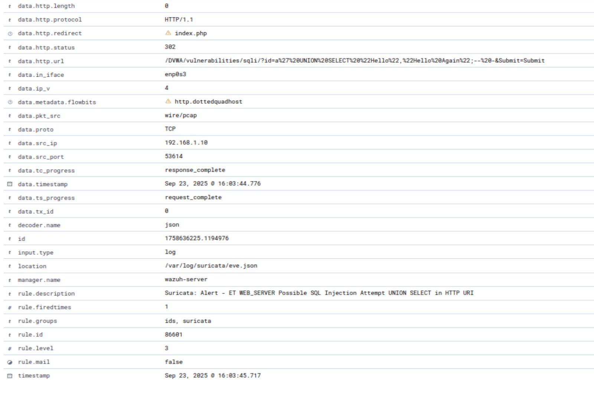
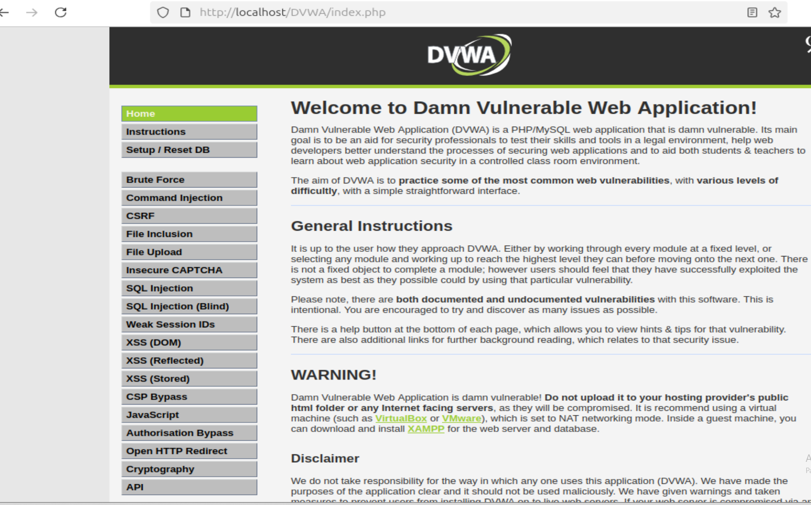

# STEP 1: 

Using pentesting tools on the Kali Linux machine, I performed several scans to gather information about the target Ubuntu machine and attack it, in order to verify whether the Wazuh agent together with Suricata detected the malicious activity.


Let's remember that Suricata is not a behavioral IDS; it is a rule-based IDS.

Therefore:

* if a rule exists → Suricata generates an alert
* if a rule does not exist → Suricata does not report anything

<br>
I created a custom Suricata rule on port 22 just to learn how to create one in the future.

**a) Open the local.rules file:**
```bash
sudo nano /etc/suricata/rules/local.rules
```

**b)Insert the Suricata rule for port 22 using the correct syntax**

**alert tcp $EXTERNAL_NET any -> $HOME_NET 22 (msg:"SSH connection detected"; flow:to_server,established; content:"SSH-2.0-OpenSSH"; sid:100001;)**
Press Ctrl+X to exit and save.

**Explanation of the rule:**
```bash
alert → generates an alert if the conditions of the rule are met.
tcp → the monitored protocol is TCP.
$EXTERNAL_NET any -> $HOME_NET 22 → traffic from any external IP to the internal network on port 22 (SSH).
msg:"SSH connection detected"; → the message that appears in the alert, indicating an SSH connection was detected.
flow:to_server,established → checks only established connections directed to the server, avoiding alerts for failed initial attempts.
content:"SSH-2.0-OpenSSH" → searches for this string in the packet content; it is the typical identifier of SSH/OpenSSH connections.
sid:100001 → unique identifier of the rule.
```
## STEP 2: Kali Linux VM used to test alert responses on the Wazuh dashboard

I fed Hydra a text file, created in 10 seconds with AI, containing a set of 4‑digit codes often used as passwords, such as 1234, 1111, 0000, 1212, etc.
If I had wanted to spend more time, I could have added longer combinations or names, but this is not a PenTesting lab, and my goal was simply to see the alerts appear on my Wazuh dashboard.
With social engineering tactics, it wouldn't be very difficult for a malicious actor to achieve the same outcome.<br>

On the dashboard, in the Discover section, dozens of alerts appeared, generated by Suricata, which detected a large number of SSH access attempts.
The Suricata signature involved is associated with reconnaissance, malware, and scanning tools such as Nmap.
Through email notifications, it is possible to configure parameters and rules so that attempts like this trigger a timely alert for the SOC analyst.
Reconnaissance is the first phase of the hacking methodology and penetration testing. It involves gathering information about the target before launching an attack.<br>


**ICMP FLOOD ATTACK** Reconnaissance / Information Gathering

| Field | Value |
|-------|-------|
| Source IP | 192.168.1.6 |
| Destination IP | 192.168.1.9 |
| Protocol | ICMP |
| Event Type | alert |
| Direction | to_server |
| Interface | enp0s3 |
| Bytes to Client | 9,280,894 |
| Bytes to Server | 9,280,992 |
| Packets to Client | 94,703 |
| Packets to Server | 94,704 |
| Flow Start | 2025-09-21T17:12:17.726354+0200 |
| Rule Description | Suricata: Alert - GPL ICMP_INFO PING *NIX |
| Rule ID | 86601 |
| Rule Fired Times | 31,575 |
| Rule Level | 3 |
| Location | /var/log/suricata/eve.json |
| Manager | wazuh-server |
| Timestamp | Sep 21, 2025 @ 17:13:32.714 |

**alert generated  <br><br>

**Spoofed_iP_ICMP_FLOOD on WIRESHARK**

<br><br>


<br>

This alert is interesting because it notifies us that a host named Kali sent an IP request to the DHCP server.
From the default ET rules (the ones we downloaded via suricata-update), this can indicate a potential reconnaissance act in the network.
Inexperienced attackers(Script Kiddies) often use Kali “out of the box” without changing the machine’s hostname. <br>

| Field | Value |
|-------|-------|
| Agent IP | 192.168.1.9 |
| Agent Name | ubu-serv |
| Alert Signature | ET POLICY Possible Kali Linux hostname in DHCP Request Packet |
| Alert Signature ID | 2022973 |
| Alert Severity | Informational |
| Alert Action | allowed |
| Application Protocol | DHCP |
| Source IP | 192.168.1.6 |
| Destination IP | 192.168.1.1 |
| Destination Port | 67 |

### STEP 3: Testing SQL Injection and XSS Attacks Against DVWA Installed on the Ubuntu Target System

**DVWA stands for Damn Vulnerable Web Application.**
It is an intentionally vulnerable web application designed for use in security testing environments, ethical hacking labs, and cybersecurity training.

**What is DVWA? (simple explanation)**
DVWA is a website full of common vulnerabilities, created to learn and practice:

* ethical hacking
* penetration testing techniques
* web exploits
* security tools (Burp Suite, sqlmap, Nikto, etc.)
* detection with IDS/IPS systems like Suricata or Wazuh

It is used by students, red teams, SOC analysts, and instructors.
What is DVWA used for?
DVWA allows you to practice:

- SQL Injection
- Command Injection
- Cross‑Site Scripting (XSS)
- CSRF (Cross‑Site Request Forgery)
- File Upload Vulnerabilities
- Brute Force Authentication
- IDOR / Broken Access Control
- Weak Session Security

```bash
sudo apt update
sudo apt -y install apache2 mariadb-server php php-mysqli php-gd libapache2-mod-php git
```

Initial MariaDB Configuration

Run the security script:
```bash
sudo mysql_secure_installation
```

**Recommended answers:**
Switch to unix_socket authentication? → N
Set root password? → Y
Remove anonymous users? → Y
Disallow root login remotely? → Y
Remove test database? → Y
Reload privilege tables? → Y

**1. This script does NOT create the DVWA database. It only secures MariaDB.**

**2. Create DVWA Database and User**
Enter MariaDB shell:
```bash
sudo mysql -u root
```

**3.Run the SQL commands:**

```bash
CREATE DATABASE dvwa;
CREATE USER 'dvwa'@'localhost' IDENTIFIED BY 'password';
GRANT ALL PRIVILEGES ON dvwa.* TO 'dvwa'@'localhost';
FLUSH PRIVILEGES;
EXIT;
```

**Test login with the DVWA user:**
```bash
mysql -u dvwa -p
```

**4. Download and Configure DVWA**
**Clone DVWA:**
```bash
cd /var/www/html
sudo git clone https://github.com/digininja/DVWA.git
```

**Edit the configuration file:**
```bash
sudo nano /var/www/html/DVWA/config/config.inc.php
```

**Set these values:**
```bash
$_DVWA['db_user'] = 'dvwa';
$_DVWA['db_password'] = 'password';
$_DVWA['db_database'] = 'dvwa';
$_DVWA['db_server'] = 'localhost';
```

**5. Start and Enable Services**
```bash
sudo systemctl start mysql
sudo systemctl start apache2
sudo systemctl enable apache2
sudo systemctl enable mariadb
```
**⚠️ If Apache fails to start, Nginx may already be using port 80**

**6. PHP Configuration**
Check PHP version:
```bash
php -v
ls /etc/php/
```

Edit PHP configuration:
```bash
sudo nano /etc/php/8.3/apache2/php.ini
```
Find:
```bash
allow_url_include
```

Set it to:
```bash
allow_url_include = On
```

**Restart Apache:**
```bash
sudo systemctl restart apache2
```
**7. Access DVWA**
Open in your browser:

**http://localhost/DVWA/setup.php**

Click Create / Reset Database.
Login using default credentials:

```bash
Username: admin
Password: password
```
**8. Installation Complete**
DVWA is now fully installed and running.

**I tried a SQL INJECTION against DVWA**
 <br>

**From Kali, using the browser, I went to the security options in the lower-left corner and selected Low for this test, then clicked on XSS (Reflected).
A pop-up window appears with the text inside the double quotes.** <br>

I entered the following script into the input field:
```bash
<script>alert("Hello");</script>
```
<br>
<br>
Wazuh successfully detected the XSS attack.

